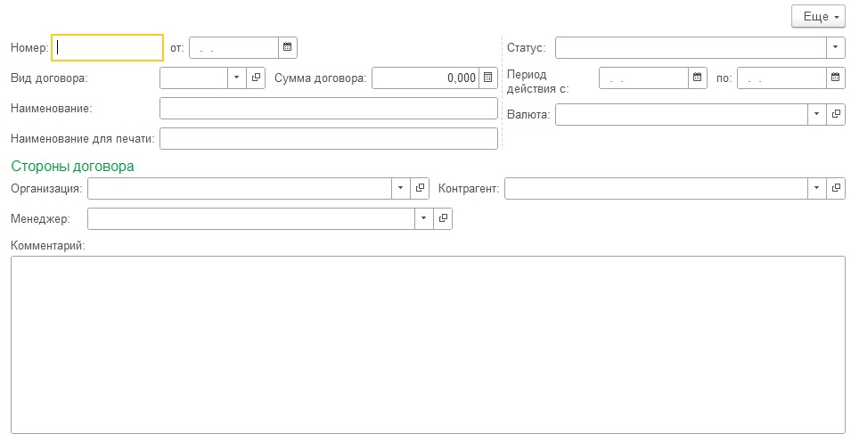

1) Обеспечить контроль уникальности кода в справочниках:
 - Валюты
 - Номенклатура

Настраивается в свойствах справочника. Без программирования.

2) Добавить в справочник "Виды договоров" реквизи "СокращенноеНаименование" - строка 20 символов.
Создать в пользовательском режиме элементы справочника "Виды договоров":
 - Наименование: "Договор хранения", Сокр. наим: "ДХ"
 - Наименование: "Договор пожертвования", Сокр.наим: "ДП"
 - Наименование: "Договор разовой закупки", Сокр.наим: "РЗ"
3) Создать элементы справочника "Источники финансирования":
 - ОМС
 - Платные услуги
 - Пожертвования

4) Создать элемент справочника "Организации"
  - Наименование: "ГБУЗ "Городская Больница №1" 
  - ИНН: 111122223333
  - КПП: 123456789
  - НаименованиеПолное: "ГОСУДАРСТВЕННОЕ БЮДЖЕТНОЕ УЧРЕЖДЕНИЕ ЗДРАВООХРАНЕНИЯ "ГОРОДСКАЯ БОЛЬНИЦА № 1""

  4.1) В процедуре модуля объекта в процедуре "ПередЗаписью" реализовать проверку, которая будет контролировать уникальность элемента справочника по ИНН. Не должно быть двух организаций с одинкаовым ИНН.
  4.2) Обеспечить обязательность заполнения реквизитов ИНН, КПП. Без программирования.

5) Установить реквизиту "Комментарий" справочника "ДоговорыКонтрагентов"  свойство "Многострочный режим".
Создать форму элемента справочника. Расположить элементы следующим образом:

   
